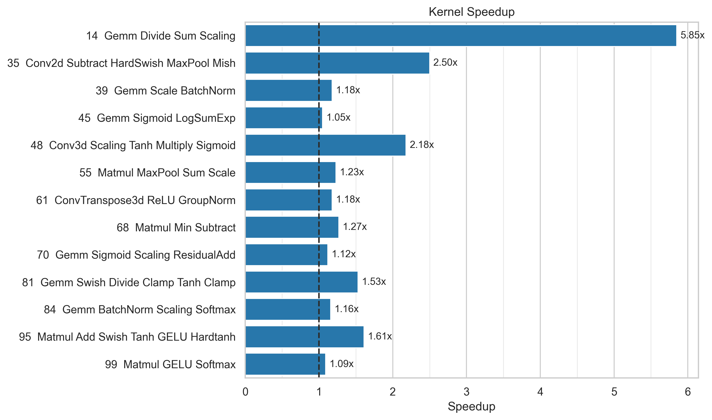
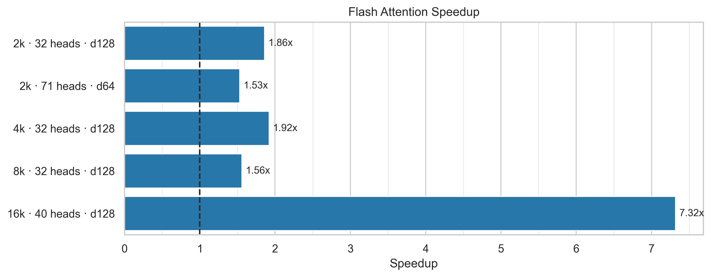

# Triton Kernel Optimizer for Intel XPU

An LLM-driven optimization loop that transforms PyTorch implementations into fast, numerically equivalent Triton kernels for Intel GPUs. The agent analyzes operations, searches optimization strategies from a curated knowledge base, generates and benchmarks kernel variants in a branching trial tree, and finalizes the best result.

→ **[Optimizing a kernel?](#quick-start)** — get running in a few minutes  
→ **[Extending the framework?](#extending-the-framework)** — port to a new target or add test cases

---

## How it Works

Claude Code drives the optimization loop, augmented by a set of specialized tools and a curated knowledge base:

- **`analyze_kernel.py`** — static analysis of the PyTorch reference: operations, tensor shapes, dtypes, and fusion opportunities.
- **`validate_triton.py`** — checks each generated kernel for syntax errors and constraint violations (autotune parameters, grid dimensions, tensor descriptor rules) before any GPU time is spent.
- **`benchmark.py`** — runs the kernel on XPU hardware via the [AI-bench](https://github.com/libxsmm/AI-bench) harness, verifying numerical correctness against the baseline and reporting wall-clock runtime.
- **`xpu_profiler.py`** — collects VTune GPU hardware counters (EU occupancy, memory bandwidth, stall cycles) and returns targeted optimization recommendations.
- **`trial_manager.py`** — maintains a tree of trials: branching from promising results, recording speedups, and finalizing the best kernel to `output/`.

The knowledge base (`kb/`) provides the optimization expertise: correctness constraints (`correctness.yaml`), XPU-specific patterns like tensor descriptors and GRF tuning (`xpu_optimizations.yaml`), fusion heuristics (`fusion_patterns.yaml`), progressive optimization levels (`optimization_levels.yaml`), and annotated before/after examples (`kb/examples/`). Claude consults these during analysis and when deciding what to try next.

The agent runs a configurable trial loop (default: 10 trials, controlled by `config.yaml`). Each trial generates a Triton kernel, validates it, benchmarks it, and uses the result — along with profiler feedback and KB strategies — to inform the next trial. The best correct kernel is finalized to `output/`.

## Quick Start

### Prerequisites

- Python 3.10+
- PyTorch with XPU support
- [Intel XPU Backend for Triton](https://github.com/intel/intel-xpu-backend-for-triton)
- Intel XPU hardware (tested on Battlemage G21 / Arc Pro B50)
- `uv` package manager
- Intel VTune Profiler 2025+ *(optional — set `vtune_enabled: false` in `config.yaml` to skip)*

### Setup

```bash
git clone https://github.com/IntelLabs/Triton8.git triton8 && cd triton8
git submodule update --init
cd modules/ai-bench && uv sync && cd ../..
python skills/benchmark.py --help   # verify install
```

### Optimize a kernel with Claude Code

```bash
cd triton8
claude
```

Inside Claude Code, give it a kernel to optimize:

```
/optimize-kernel 70_Gemm_Sigmoid_Scaling_ResidualAdd
```

Claude searches the `test_kernels/` directory for `70_Gemm_Sigmoid_Scaling_ResidualAdd_pytorch.py` and `70_Gemm_Sigmoid_Scaling_ResidualAdd.yaml`, analyzes the reference, and starts the trial loop. You can watch the progress in the terminal or open another shell to check trial status:

### Use the tools directly

```bash
# Analyze a PyTorch kernel — operations, shapes, fusion opportunities
python skills/analyze_kernel.py test_kernels/99_Matmul_GELU_Softmax_pytorch.py

# Validate a Triton kernel — syntax and autotune constraint checks
python skills/validate_triton.py my_kernel.py

# Benchmark — correctness + performance against a PyTorch baseline
python skills/benchmark.py test_kernels/99_Matmul_GELU_Softmax_pytorch.py my_kernel.py

# Benchmark against a Triton baseline instead of PyTorch
python skills/benchmark.py baseline_triton.py optimized_triton.py --triton-baseline

# CI mode — correctness check only, no timing
python skills/benchmark.py baseline.py triton.py --ci

# VTune profiling (requires XPU hardware + VTune)
python skills/xpu_profiler.py my_kernel.py
```

---

## Results

Measured on Intel Battlemage G21 / Arc Pro B50 (128 XVEs). All runtimes are median of benchmark trials. [Full results table](assets/readme/results-speedup-tflops.md).

### [KernelBench](https://github.com/KernelBench/KernelBench) Level 2 — Fused Kernels (bf16)

Speedup is vs. PyTorch eager baseline.



### Flash Attention Forward (fp16)

Baseline is the flash attention kernel from the [XPU Triton backend](https://github.com/intel/intel-xpu-backend-for-triton); speedup is vs. that kernel.



**Notes:**
- All runtimes are median of benchmark trials.
- TFLOPS = GFLOP / runtime_seconds / 10^3. FLOP counts are dominated by the matmul/convolution ops (2MNK for GEMM, 2·B·C_out·O_size·C_in·K_size for conv). Convolution FLOP counts (kernels 35, 48, 61) exclude pooling/norm/activation.
- Flash attention FLOPs use the standard 4·B·A·S²·D formula (two matmuls: Q@K^T and P@V).

---

## Project Layout

```
triton8/
├── CLAUDE.md                            # Agent workflow — source of truth for Claude Code
├── config.yaml                          # max_trials, vtune_enabled, vtune_bin
│
├── kb/                                  # Knowledge base (read-only, consulted by agent)
│   ├── implementation_reference.md      # Code templates, Model class pattern
│   ├── correctness.yaml                 # Hard constraints (autotune, grid, descriptors)
│   ├── xpu_optimizations.yaml           # Tensor descriptors, GRF mode, tile swizzling
│   ├── optimization_strategies.md       # Strategy reference + "try harder" decision tree
│   ├── optimization_levels.yaml         # Progressive L1–L5 optimization levels
│   ├── workflow_details.md              # Detailed workflow, decision tree, benchmarking
│   ├── fusion_patterns.yaml             # When to fuse vs split
│   ├── memory_patterns.yaml             # Access patterns and coalescing
│   ├── dtype_optimizations.yaml         # Mixed precision choices
│   ├── persistent_kernel_patterns.yaml  # Stream K and persistent kernel patterns
│   └── examples/                        # Annotated before/after reference implementations
│
├── templates/                           # Copy-and-modify kernel starting points
│   ├── gemm_template.py
│   ├── gemm_epilogue_template.py
│   └── reduction_template.py
│
├── skills/                      # Standalone tools (used by agent and manually)
│   ├── analyze_kernel.py        # PyTorch → operations, shapes, fusion opportunities
│   ├── validate_triton.py       # Syntax + constraint checks before benchmarking
│   ├── benchmark.py             # Correctness + performance via ai-bench
│   ├── trial_manager.py         # Tree-structured trial init/save/record/finalize
│   ├── xpu_profiler.py          # VTune GPU hardware counters + recommendations
│   └── config.py                # Shared configuration loader for config.yaml
│
├── test_kernels/                # PyTorch reference implementations + YAML specs
├── modules/ai-bench/            # Benchmark harness (git submodule)
├── output/                      # Finalized optimized kernels
└── trials/                      # Trial tree state (managed by trial_manager.py)
```

---

## Extending the Framework

### Adding a test kernel

**1. PyTorch reference** (`test_kernels/XX_Name_pytorch.py`):

```python
import torch
import torch.nn as nn

class Model(nn.Module):
    def __init__(self, dim_a, dim_b):        # args match get_init_inputs()
        super().__init__()
        self.fc = nn.Linear(dim_a, dim_b)

    def forward(self, x):
        return self.fc(x)

# Module-level constants used by get_inputs() and get_init_inputs()
batch_size = 1024
dim_a = 4096
dim_b = 4096

def get_inputs():
    """Input tensors for the forward pass."""
    return [torch.rand(batch_size, dim_a)]

def get_init_inputs():
    """Positional args for Model.__init__()."""
    return [dim_a, dim_b]
```

`get_inputs()` and `get_init_inputs()` are the ai-bench interface. Shapes and values here must match the YAML spec below.

**2. Problem spec** (`test_kernels/XX_Name.yaml`):

```yaml
inputs:
  X:
    shape: [BATCH, DIM]
    dtype: inherit

inits:
  - dim: DIM
  - dim: HIDDEN

ci:                           # small-dim correctness check used in CI
  - params: [X]
    dtype: float32
    dims: {BATCH: 2, DIM: 64, HIDDEN: 64}
    flop: "2*BATCH*DIM*HIDDEN"

bench-gpu:                    # realistic-dim performance benchmark
  - params: [X]
    dtype: bfloat16
    dims: {BATCH: 1024, DIM: 4096, HIDDEN: 4096}
    flop: "2*BATCH*DIM*HIDDEN"
    rtol: 0.01
    atol: 1.0e-05
```

**3. (Optional)** Add new optimization patterns to `CLAUDE.md` and the relevant `kb/*.yaml` file if the kernel introduces patterns not yet covered.


### Authoring KB patterns

Each `kb/*.yaml` file uses a consistent schema. To add a pattern:

```yaml
- id: my_new_pattern
  title: "Short descriptive title"
  applies_to: [gemm, reduction]
  recommendation: FUSE          # FUSE | SPLIT | AVOID
  reason: "One sentence explanation."
  speedup_range: "1.5-3x"
  code_before: |
    # Naive approach
  code_after: |
    # Optimized approach
```

For substantial patterns, add a reference implementation to `kb/examples/` as an `*_optimized.py` / `*_unoptimized.py` pair and register it in `kb/examples/index.yaml`:

```yaml
- id: my_pattern_example
  file: kb/examples/my_pattern_optimized.py
  description: "What this demonstrates"
  patterns: [my_new_pattern]
  speedup: "1.5-3x"
```

## Knowledge Base

`kb/` is organized in two tiers.

**Read first:**
- `implementation_reference.md` — code templates, the `Model` class pattern, GEMM walkthrough
- `correctness.yaml` — hard constraints: autotune params, grid dimensions, boundary checks, tensor descriptor rules
- `xpu_optimizations.yaml` — XPU-specific patterns: tensor descriptors, GRF mode, tile swizzling

**Consult as needed:**
- `optimization_strategies.md` — full strategy reference and "try harder" decision tree
- `optimization_levels.yaml` — progressive L1–L5 levels with expected speedup ranges
- `fusion_patterns.yaml` — when to fuse vs split
- `memory_patterns.yaml` — access patterns and coalescing
- `dtype_optimizations.yaml` — bf16/fp16 inputs with fp32 accumulation
- `persistent_kernel_patterns.yaml` — Stream K and persistent kernel techniques

## Porting to a different target

The trial loop, knowledge base, and template infrastructure are not tied to a specific device. Four components are hardware-specific; everything else works without modification.

**1. Replace the benchmark harness.** `skills/benchmark.py` calls into `modules/ai-bench`. Swap it for a harness that invokes your target device. The script must emit `correctness: pass/fail` and `triton_us: <float>` in a format `trial_manager.py` can parse — see the existing `benchmark.py` for the output contract.

**2. Replace or disable the profiler.** `skills/xpu_profiler.py` is VTune-specific. Implement an equivalent for your target, or set `vtune_enabled: false` in `config.yaml` to skip profiling steps entirely.

**3. Add target-specific KB files.** Create `kb/<target>_optimizations.yaml` with hardware-specific patterns (tile sizes, memory hierarchy, native intrinsics). Update `CLAUDE.md` to point the agent to the new file during Step 1 analysis.

**4. Update `CLAUDE.md`.** This file is the agent's workflow source of truth. Add target-specific constraints, preferred memory access APIs, and correctness rules.

`trial_manager.py`, `analyze_kernel.py`, `validate_triton.py`, the rest of `kb/`, and `templates/` work without modification.

## Resources

- [Intel XPU Backend for Triton](https://github.com/intel/intel-xpu-backend-for-triton)
- [Triton Language Guide](https://triton-lang.org/)
- [Claude Code](https://github.com/anthropics/claude-code)

## Citation

If you use Triton8 and find it useful, please cite our work:

```bibtex
@software{triton8,
  title   = {Triton8: LLM-Driven Triton Kernel Optimization for Intel GPU},
  author  = {{Intel AI Software}},
  year    = {2026},
  url     = {https://github.com/IntelLabs/Triton8}
}
```

## License

The code is licensed under the Apache 2.0 License.

## Disclaimer

This is not an official Intel product.